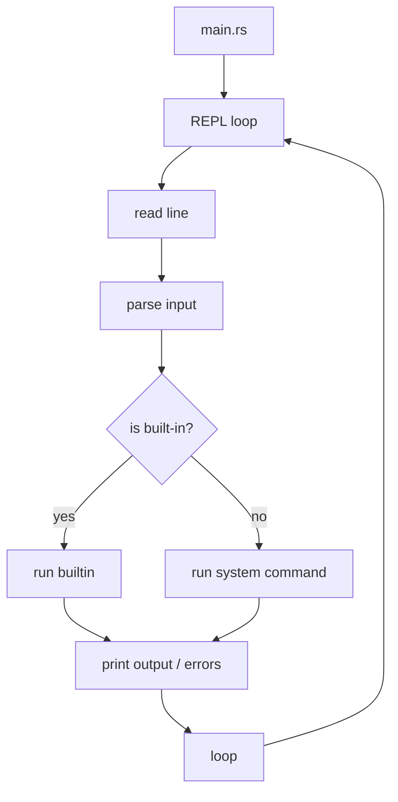

# Design - Shellter

## Problem Statement

Build a lightweight Rust REPL that mimics shell behavior, allowing users to execute built-in and external commands while maintaining shell state (working directory).

## Requirements

### Functional

- Accept and parse user input into commands and arguments
- Execute built-in commands (cd, pwd, exit, help)
- Execute external system commands via subprocess
- Maintain and display current working directory
- Handle command execution errors gracefully

### Non-Functional

- Performance: Minimal startup time and command dispatch overhead
- Memory: Low memory footprint for the REPL process
- Portability: Cross-platform Rust implementation
- Simplicity: Single-file or minimal module structure, no external dependencies

## Architecture Overview

- **Main components**: Input reader, command parser, built-in dispatcher, system command executor
- **Responsibilities**: Each component handles one phase of the command lifecycle
- **Data flow**: Input → Parse → Dispatch → Execute → Output

## 🔄 Alternatives Considered

| Option                    | Pros             | Cons                                | Why Rejected                      |
| ------------------------- | ---------------- | ----------------------------------- | --------------------------------- |
| External shell library    | Feature-rich     |                                     | Violates no-dependency constraint |
| Single monolithic file    | Simplicity       | Poor code organization, not modular | Prevent expantion                 |
| Full shell implementation | Complete product | Time consuming                      | Exceeds weekend scope             |

## Trade-offs

Excluded redirection, piping, and environment expansion to meet weekend timeline. Prioritized core functionality over advanced features.

## 🔬 Open Questions

- How to elegantly handle path resolution for external commands?
- Best practice for storing shell state across REPL iterations?

## Success Criteria

- User can launch the REPL and execute built-in commands (cd, pwd, exit)
- External commands execute and display output correctly
- Working directory persists across commands
- All code compiles without warnings and includes basic tests
